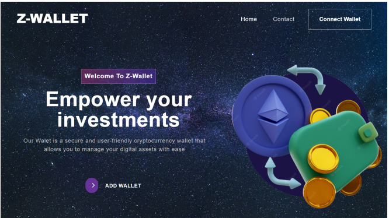

# Z Wallet

  

  

Z Wallet is an innovative blockchain wallet designed to meet the growing demand for financial applications. This project is primarily concerned with the development and implementation
of smart contract standards ERC20 and ERC721, which manage our token ZToken and our Minted NFTs .  

## Features :  
- Connect your account to ZWallet
- Buy the Ztoken with ETH
- View wallet balances(ETH and ZTK)
- Generate NFT with IA (Hugging Face API)
- Mint the NFTs with Ztoken or ETH 
- Buy and Sell NFTs with ZTK and ETH 
## Technologies Used :
- Ethereum
- Solidity
- Web3.js
- React.js
- Node.js
- Truffle
- Javascript
- HTML/CSS
- Jest
## Prerequisites :
- Node.js (version 16.15.0)
- Truffle (version 5.8.4)
- Ganache (version 7.8.0)
- Web3.js (version 1.8.2)
- Metamask browser extension
## Installation :
### 1. Clone the repository:
git clone https://github.com/FirasMosbahi/z-wallet.git
### 2.Install the dependencies:
npm install  

cd ui  

npm install
### 3.Compile and migrate the smart contracts:
truffle compile  

truffle migrate
### 4.Start the development server
cd ui  

npm run start

## Contributing: 
Contributions to ZWallet are welcome! If you find any bugs or want to suggest new features, please open an issue or submit a pull request.

